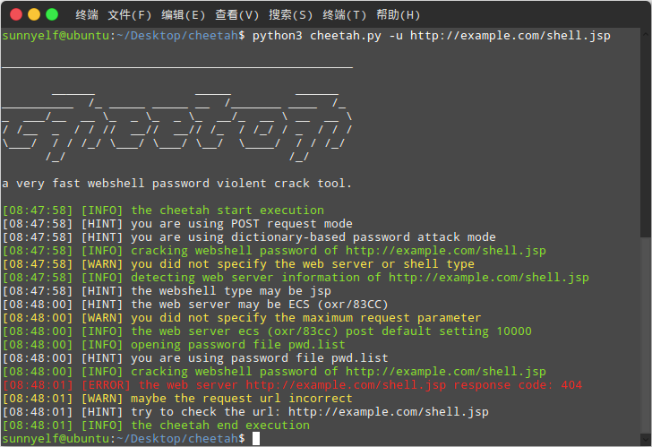
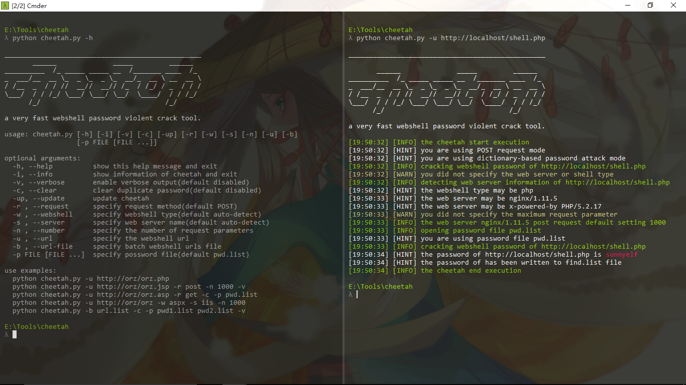
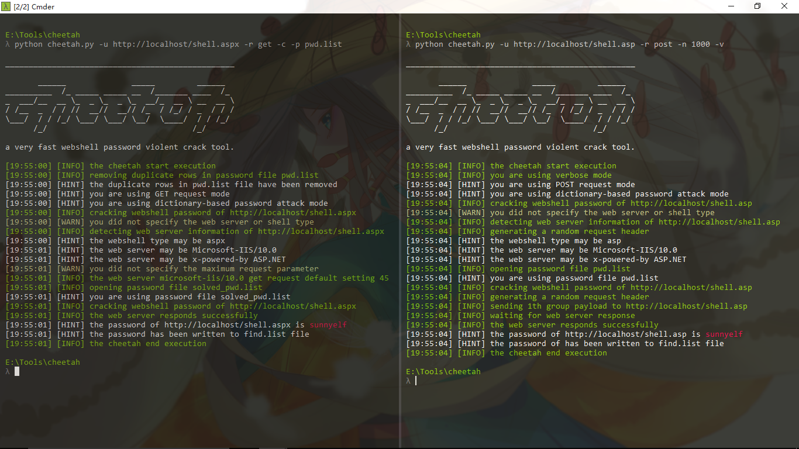
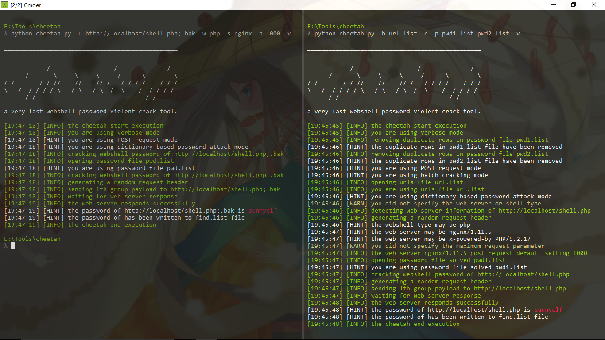

[English description](README.md) | [中文说明](README_zh.md)

 

# 0x00 cheetah

[Cheetah](https://github.com/sunnyelf/cheetah) is a dictionary-based brute force password webshell tool, running as fast as a cheetah hunt for prey. 

Cheetah's working principle is that it can submit a large number of detection passwords based on different web services at once, blasting efficiency is thousands of times other common brute force password webshell tools.

This version may later be infrequently updated, please use the [Cheetah GUI](https://github.com/sunnyelf/cheetah-gui) version!

# 0x01 features

* Fast speed.

* Support python 2.x and python 3.x

* Support to read large password dictionary file.

* Support to remove duplicate passwords of large password dictionary file.

* Support for automatic detection of web services.

* Support brute force batch webshell urls password.

* Support for automatic forgery request header.

* Currently support php, jsp, asp, aspx webshell.

# 0x02 parameter description

python cheetah.py -h

	_________________________________________________
	       ______              _____         ______
	__________  /_ _____ _____ __  /_______ ____  /_
	_  ___/__  __ \_  _ \_  _ \_  __/_  __ \ __  __ \
	/ /__  _  / / //  __//  __// /_  / /_/ / _  / / /
	\___/  / / /_/ \___/ \___/ \__/  \____/  / / /_/
	      /_/                               /_/
	
	a very fast brute force webshell password tool.
	
	usage: cheetah.py [-h] [-i] [-v] [-c] [-up] [-r] [-w] [-s] [-n] [-u] [-b]
	                   [-p [file [file ...]]]
	
	optional arguments:
	  -h, --help            show this help message and exit
	  -i, --info            show information of cheetah and exit
	  -v, --verbose         enable verbose output(default disabled)
	  -c, --clear           clear duplicate password(default disabled)
	  -up, --update         update cheetah
	  -r , --request        specify request method(default POST)
	  -t , --time           specify request interval seconds(default 0)
	  -w , --webshell       specify webshell type(default auto-detect)
	  -s , --server         specify web server name(default auto-detect)
	  -n , --number         specify the number of request parameters
	  -u , --url            specify the webshell url
	  -b , --url-file       specify batch webshell urls file
	  -p file [file ...]    specify possword file(default data/pwd.list)
	
	use examples:
	  python cheetah.py -u http://orz/orz.php
	  python cheetah.py -u http://orz/orz.jsp -r post -n 1000 -v
	  python cheetah.py -u http://orz/orz.asp -r get -c -p pwd.list
	  python cheetah.py -u http://orz/orz -w aspx -s iis -n 1000
	  python cheetah.py -b url.list -c -p pwd1.list pwd2.list -v

# 0x03 screenshot

## Ubuntu

## Windows

# 0x03 download and use and update cheetah #

	git clone https://github.com/sunnyelf/cheetah.git
	python cheetah.py 
	git pull orgin master

# 0x04 files description #

	cheetah:
	│  .codeclimate.yml
	│  .gitignore
	│  .travis.yml
	│  cheetah.py              mian program
	│  LICENSE
	│  README.md
	│  README_zh.md
	│  update.py               update module
	│
	├─data 
	│      big_shell_pwd.7z   big shell password file
	│      pwd.list           default shell password file
	│      url.list           default batch webshell urls file
	│      user-agent.list    user agent file
	│
	└─images
	        1.png
	        2.png
	        3.png
	        4.png
	        logo.jpg
